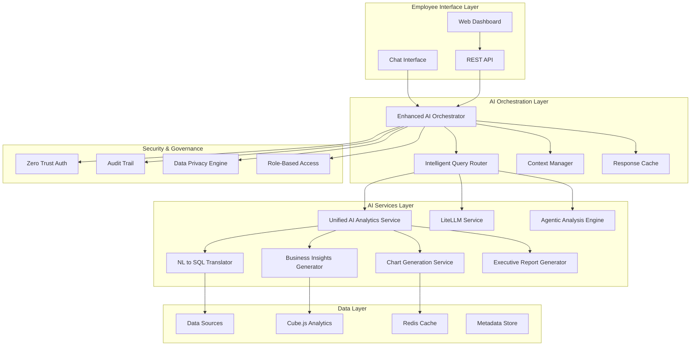
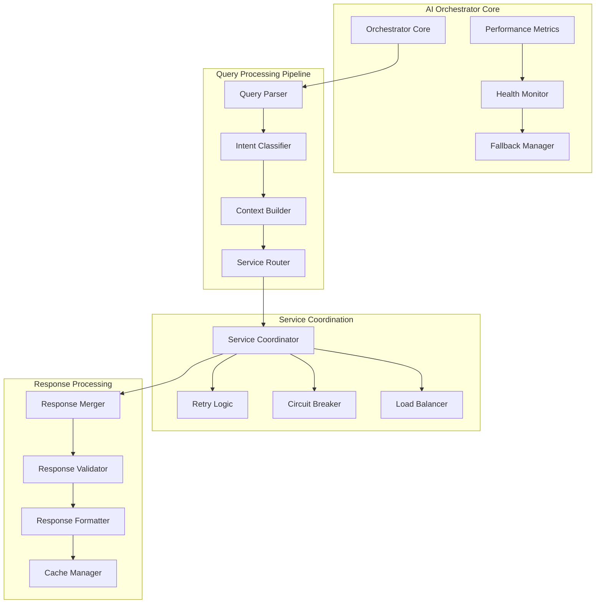
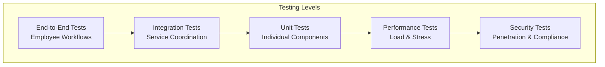
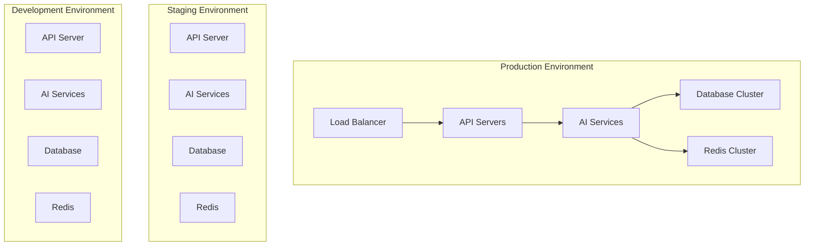

# Design Document

## Overview

The AI Agentic Workflow Enhancement transforms Aiser into a world-class, employee-centric data analysis platform that democratizes data capabilities across the entire organization. The design consolidates existing AI services, implements a robust orchestration layer, and creates an intuitive chat interface that enables any employee to become "data capable" regardless of their technical background.

The enhanced system provides end-to-end AI-native workflows: natural language query → intelligent SQL generation → optimized execution → dynamic visualization → business insights → actionable recommendations → executive reporting, all through a conversational interface that adapts to each user's role and expertise level.

## Architecture

### High-Level Architecture



### Enhanced AI Orchestrator Architecture



## Components and Interfaces

### 1. Enhanced AI Orchestrator

**Purpose**: Central coordination hub that intelligently routes queries, manages AI services, and ensures reliable operation.

**Key Features**:
- Intelligent query routing based on complexity and data requirements
- Service health monitoring with automatic failover
- Response caching and optimization
- Performance metrics and monitoring
- Circuit breaker pattern for resilience

**Interface**:
```python
class EnhancedAIOrchestrator:
    async def process_employee_query(
        self, 
        query: str, 
        user_context: UserContext,
        data_sources: List[DataSource]
    ) -> AnalysisResult
    
    async def route_to_optimal_service(
        self, 
        query_analysis: QueryAnalysis
    ) -> ServiceRoute
    
    async def coordinate_multi_service_analysis(
        self, 
        services: List[AIService]
    ) -> CoordinatedResult
```

### 2. Employee-Centric Chat Interface

**Purpose**: Conversational interface that adapts to each employee's role, expertise level, and business context.

**Key Features**:
- Role-aware conversation flow
- Contextual suggestions and guidance
- Progressive disclosure of complexity
- Multi-modal input/output (text, charts, tables)
- Conversation memory and learning

**Interface**:
```typescript
interface EmployeeChatInterface {
  processMessage(
    message: string,
    userProfile: EmployeeProfile,
    conversationHistory: ConversationHistory
  ): Promise<ChatResponse>
  
  suggestQuestions(
    userRole: string,
    availableData: DataSource[]
  ): Promise<QuestionSuggestion[]>
  
  adaptResponseComplexity(
    response: AnalysisResult,
    userExpertiseLevel: ExpertiseLevel
  ): Promise<AdaptedResponse>
}
```

### 3. Unified AI Analytics Service (Enhanced)

**Purpose**: Consolidated AI service that provides all analytics capabilities through a single, optimized interface.

**Key Enhancements**:
- Employee-focused analysis types
- Business context understanding
- Confidence scoring and explanation
- Multi-step reasoning capabilities
- Automated insight generation

**Interface**:
```python
class UnifiedAIAnalyticsService:
    async def analyze_for_employee(
        self,
        query: str,
        employee_profile: EmployeeProfile,
        data_context: DataContext
    ) -> EmployeeAnalysisResult
    
    async def generate_role_specific_insights(
        self,
        analysis_result: AnalysisResult,
        employee_role: str
    ) -> RoleSpecificInsights
    
    async def create_executive_summary(
        self,
        detailed_analysis: AnalysisResult
    ) -> ExecutiveSummary
```

### 4. Natural Language to SQL Translator (Enhanced)

**Purpose**: Advanced NL to SQL translation with business context awareness and optimization.

**Key Features**:
- Business terminology understanding
- Query optimization for performance
- Multi-table join intelligence
- Error detection and correction
- Explanation generation

**Interface**:
```python
class EnhancedNL2SQLTranslator:
    async def translate_with_context(
        self,
        natural_query: str,
        business_context: BusinessContext,
        schema_metadata: SchemaMetadata
    ) -> SQLTranslationResult
    
    async def optimize_for_performance(
        self,
        sql_query: str,
        data_source: DataSource
    ) -> OptimizedSQL
    
    async def explain_sql_logic(
        self,
        sql_query: str,
        user_expertise: ExpertiseLevel
    ) -> SQLExplanation
```

### 5. Business Insights Generator

**Purpose**: Generates contextual business insights tailored to different organizational roles and objectives.

**Key Features**:
- Role-specific insight generation
- Industry best practices integration
- Trend identification and forecasting
- Anomaly detection and alerting
- Actionable recommendation creation

**Interface**:
```python
class BusinessInsightsGenerator:
    async def generate_insights_for_role(
        self,
        data_analysis: DataAnalysis,
        employee_role: str,
        business_objectives: List[str]
    ) -> RoleSpecificInsights
    
    async def identify_actionable_opportunities(
        self,
        insights: List[Insight]
    ) -> List[ActionableOpportunity]
    
    async def create_executive_briefing(
        self,
        insights: List[Insight],
        recommendations: List[Recommendation]
    ) -> ExecutiveBriefing
```

### 6. Zero Trust Security Engine

**Purpose**: Implements comprehensive zero-trust security across all AI operations.

**Key Features**:
- Identity verification for every request
- Data access authorization
- Audit trail generation
- Data masking and anonymization
- Compliance monitoring

**Interface**:
```python
class ZeroTrustSecurityEngine:
    async def authorize_data_access(
        self,
        user: User,
        data_source: DataSource,
        operation: str
    ) -> AuthorizationResult
    
    async def audit_ai_operation(
        self,
        operation: AIOperation,
        user: User,
        data_accessed: List[str]
    ) -> AuditRecord
    
    async def apply_data_privacy_rules(
        self,
        data: DataFrame,
        privacy_rules: List[PrivacyRule]
    ) -> PrivacyCompliantData
```

## Data Models

### Core Data Models

```python
@dataclass
class EmployeeProfile:
    user_id: str
    role: str  # 'executive', 'manager', 'analyst', 'employee'
    department: str
    expertise_level: ExpertiseLevel
    preferred_complexity: str
    business_objectives: List[str]
    data_permissions: List[str]

@dataclass
class QueryAnalysis:
    original_query: str
    intent: QueryIntent
    complexity_score: float
    required_data_sources: List[str]
    business_context: str
    urgency_level: str
    confidence_score: float

@dataclass
class AnalysisResult:
    query: str
    sql_generated: Optional[str]
    data_summary: DataSummary
    visualizations: List[Visualization]
    insights: List[Insight]
    recommendations: List[Recommendation]
    confidence_metrics: ConfidenceMetrics
    execution_metadata: ExecutionMetadata

@dataclass
class EmployeeAnalysisResult(AnalysisResult):
    role_specific_insights: List[RoleSpecificInsight]
    simplified_explanation: str
    next_steps: List[str]
    related_questions: List[str]
    executive_summary: Optional[ExecutiveSummary]

@dataclass
class BusinessContext:
    industry: str
    company_size: str
    business_model: str
    key_metrics: List[str]
    seasonal_factors: List[str]
    competitive_landscape: str
```

### AI Service Models

```python
@dataclass
class AIServiceHealth:
    service_name: str
    status: ServiceStatus
    response_time_avg: float
    success_rate: float
    last_health_check: datetime
    error_count: int

@dataclass
class ServiceRoute:
    primary_service: str
    fallback_services: List[str]
    routing_confidence: float
    expected_response_time: float
    resource_requirements: ResourceRequirements

@dataclass
class CoordinatedResult:
    primary_result: AnalysisResult
    supporting_results: List[AnalysisResult]
    coordination_metadata: CoordinationMetadata
    overall_confidence: float
```

## Error Handling

### Comprehensive Error Handling Strategy

```python
class AIWorkflowErrorHandler:
    async def handle_orchestrator_failure(
        self, 
        error: Exception, 
        context: RequestContext
    ) -> FallbackResponse:
        """Handle AI orchestrator failures with intelligent fallback"""
        
    async def handle_service_timeout(
        self, 
        service: str, 
        timeout_duration: float
    ) -> TimeoutResponse:
        """Handle service timeouts with circuit breaker logic"""
        
    async def handle_data_access_error(
        self, 
        data_source: str, 
        error: Exception
    ) -> DataAccessFallback:
        """Handle data access errors with alternative sources"""
        
    async def handle_ai_model_error(
        self, 
        model: str, 
        error: Exception
    ) -> ModelFallback:
        """Handle AI model errors with fallback models"""
```

### Error Recovery Patterns

1. **Circuit Breaker Pattern**: Automatically disable failing services and route to alternatives
2. **Retry with Exponential Backoff**: Intelligent retry logic for transient failures
3. **Graceful Degradation**: Provide simplified responses when full analysis fails
4. **Fallback Chains**: Multiple fallback options for each service
5. **User-Friendly Error Messages**: Convert technical errors to actionable guidance

## Testing Strategy

### Testing Pyramid



### Test Categories

1. **Employee Experience Tests**
   - Role-based conversation flows
   - Query understanding accuracy
   - Response appropriateness
   - Learning and adaptation

2. **AI Orchestrator Tests**
   - Service routing accuracy
   - Failover mechanisms
   - Performance under load
   - Circuit breaker functionality

3. **AI Service Integration Tests**
   - Service coordination
   - Response merging
   - Confidence scoring
   - Error propagation

4. **Data Security Tests**
   - Zero-trust implementation
   - Data access controls
   - Audit trail completeness
   - Privacy compliance

5. **Performance Tests**
   - Response time benchmarks
   - Concurrent user handling
   - Resource utilization
   - Scalability limits

### Test Implementation

```python
class EmployeeWorkflowTests:
    async def test_non_technical_user_analysis(self):
        """Test complete workflow for non-technical employee"""
        
    async def test_executive_summary_generation(self):
        """Test executive-level reporting"""
        
    async def test_role_adaptation(self):
        """Test response adaptation to different roles"""

class AIOrchestratorTests:
    async def test_service_failover(self):
        """Test automatic failover to backup services"""
        
    async def test_intelligent_routing(self):
        """Test query routing to optimal services"""
        
    async def test_performance_monitoring(self):
        """Test performance metrics collection"""

class SecurityTests:
    async def test_zero_trust_implementation(self):
        """Test zero-trust security enforcement"""
        
    async def test_data_access_controls(self):
        """Test role-based data access"""
        
    async def test_audit_trail_completeness(self):
        """Test comprehensive audit logging"""
```

## Performance Optimization

### Optimization Strategies

1. **Intelligent Caching**
   - Query result caching with context awareness
   - AI model response caching
   - Metadata caching for faster routing

2. **Service Optimization**
   - Connection pooling for data sources
   - Async processing for non-blocking operations
   - Resource allocation based on query complexity

3. **Response Optimization**
   - Streaming responses for long-running analyses
   - Progressive loading of complex visualizations
   - Compression for large datasets

4. **AI Model Optimization**
   - Model selection based on query complexity
   - Prompt optimization for faster responses
   - Batch processing for multiple queries

### Performance Monitoring

```python
class PerformanceMonitor:
    def track_response_times(self, service: str, duration: float):
        """Track service response times"""
        
    def monitor_resource_usage(self, service: str, resources: ResourceUsage):
        """Monitor CPU, memory, and network usage"""
        
    def track_user_satisfaction(self, user_id: str, satisfaction_score: float):
        """Track user satisfaction metrics"""
        
    def generate_performance_report(self) -> PerformanceReport:
        """Generate comprehensive performance report"""
```

## Deployment Architecture

### Multi-Environment Deployment



### Scalability Considerations

1. **Horizontal Scaling**
   - Auto-scaling based on demand
   - Load balancing across AI services
   - Database sharding for large datasets

2. **Vertical Scaling**
   - Resource allocation based on workload
   - GPU acceleration for AI models
   - Memory optimization for large analyses

3. **Geographic Distribution**
   - Edge deployment for reduced latency
   - Data locality for compliance
   - Regional failover capabilities

This design provides a comprehensive foundation for transforming Aiser into an employee-centric, AI-native analytics platform that democratizes data capabilities across the entire organization while maintaining enterprise-grade security, performance, and reliability.