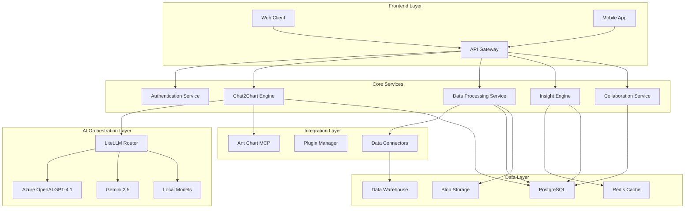

# Aiser Platform Design Document

## Overview

Aiser is designed as a modern, AI-powered analytics platform that rivals PowerBI while maintaining an open-source core. The architecture leverages microservices, AI orchestration through LiteLLM, deep Ant Chart MCP integration, and a plugin-based extensibility model. The platform is built to scale from individual users to enterprise deployments while providing intelligent, proactive, and personalized analytics experiences.

## Architecture

### High-Level Architecture



### Microservices Architecture

The platform follows a microservices architecture with the following core services:

1. **API Gateway**: Central entry point handling routing, authentication, and rate limiting
2. **Chat2Chart Engine**: Core AI-powered chart generation and natural language processing
3. **Authentication Service**: Centralized authentication and authorization
4. **Data Processing Service**: ETL operations, data validation, and transformation leveraging open source tooling
5. **Insight Engine**: Proactive analytics, anomaly detection, and predictive modeling leveraging open source tooling
6. **Collaboration Service**: Real-time collaboration, sharing, and governance

## Components and Interfaces

### Chat2Chart Engine

The Chat2Chart Engine is the heart of the platform, responsible for converting natural language queries into meaningful visualizations.

**Core Components:**
- **Natural Language Processor**: Parses user queries and extracts intent
- **Data Analyzer**: Examines data characteristics and suggests appropriate visualizations
- **Chart Generator**: Creates charts using Ant Design Charts through MCP protocol
- **Context Manager**: Maintains conversation context and user preferences

**Key Interfaces:**
```typescript
interface Chat2ChartEngine {
  processQuery(query: string, data: Dataset, context: ConversationContext): Promise<ChartResponse>
  generateChart(specification: ChartSpec, data: Dataset): Promise<Chart>
  suggestVisualizations(data: Dataset): Promise<VisualizationSuggestion[]>
  explainInsight(chart: Chart, insight: Insight): Promise<Explanation>
}

interface ChartResponse {
  chart: Chart
  explanation: string
  suggestions: string[]
  confidence: number
}
```

### LiteLLM Integration Layer

The LiteLLM integration provides a unified interface to multiple AI models while handling failover, load balancing, and cost optimization.

**Configuration:**
```typescript
interface LiteLLMConfig {
  models: {
    primary: ModelConfig
    fallback: ModelConfig[]
  }
  routing: RoutingStrategy
  costOptimization: CostSettings
}

interface ModelConfig {
  provider: 'azure' | 'openai' | 'google' | 'local'
  model: string
  apiKey?: string
  endpoint?: string
  maxTokens: number
  temperature: number
}
```

### Ant Chart MCP Integration

Deep integration with Ant Design Charts through the Model Context Protocol enables rich, interactive visualizations.

**MCP Interface:**
```typescript
interface AntChartMCP {
  createChart(type: ChartType, data: any[], config: ChartConfig): Promise<Chart>
  updateChart(chartId: string, updates: Partial<ChartConfig>): Promise<Chart>
  applyTheme(chartId: string, theme: Theme): Promise<void>
  addInteraction(chartId: string, interaction: InteractionConfig): Promise<void>
}

interface ChartConfig {
  xField: string
  yField: string
  seriesField?: string
  color?: string | string[]
  theme?: 'light' | 'dark' | 'custom'
  interactions?: InteractionConfig[]
}
```

### Data Connectivity Layer

Universal data connectivity supporting everything from simple files to enterprise data warehouses.

**Connector Architecture:**
```typescript
interface DataConnector {
  connect(config: ConnectionConfig): Promise<Connection>
  query(connection: Connection, query: Query): Promise<Dataset>
  schema(connection: Connection): Promise<Schema>
  refresh(connection: Connection): Promise<void>
}

interface ConnectionConfig {
  type: 'file' | 'database' | 'api' | 'warehouse'
  credentials: Record<string, any>
  settings: Record<string, any>
}
```

**Supported Data Sources:**
- **Files**: CSV, Excel, JSON, Parquet, XML
- **Databases**: PostgreSQL, MySQL, SQL Server, Oracle, MongoDB
- **Cloud Warehouses**: Snowflake, BigQuery, Redshift, Azure Synapse
- **APIs**: REST, GraphQL, streaming endpoints
- **Cloud Storage**: AWS S3, Azure Blob, Google Cloud Storage

### Insight Engine

Proactive intelligence system that automatically identifies patterns, anomalies, and opportunities.

**Core Capabilities:**
- **Anomaly Detection**: Statistical and ML-based outlier identification
- **Trend Analysis**: Time series analysis and forecasting
- **Pattern Recognition**: Correlation and causation analysis
- **Predictive Modeling**: Regression, classification, and time series forecasting

```typescript
interface InsightEngine {
  analyzeData(dataset: Dataset): Promise<Insight[]>
  detectAnomalies(dataset: Dataset, config: AnomalyConfig): Promise<Anomaly[]>
  generateForecast(dataset: Dataset, target: string, horizon: number): Promise<Forecast>
  explainPattern(pattern: Pattern): Promise<Explanation>
}
```

## Data Models

### Core Data Models

```typescript
interface Dataset {
  id: string
  name: string
  columns: Column[]
  rows: Record<string, any>[]
  metadata: DatasetMetadata
  source: DataSource
}

interface Column {
  name: string
  type: 'string' | 'number' | 'date' | 'boolean'
  nullable: boolean
  unique: boolean
  statistics?: ColumnStatistics
}

interface Chart {
  id: string
  type: ChartType
  title: string
  data: Dataset
  config: ChartConfig
  insights: Insight[]
  createdAt: Date
  updatedAt: Date
}

interface Insight {
  id: string
  type: 'trend' | 'anomaly' | 'correlation' | 'forecast'
  description: string
  confidence: number
  impact: 'low' | 'medium' | 'high'
  actionable: boolean
  recommendations: string[]
}

interface User {
  id: string
  email: string
  name: string
  role: UserRole
  preferences: UserPreferences
  organizations: Organization[]
}

interface UserPreferences {
  defaultChartTypes: ChartType[]
  colorScheme: string
  language: string
  timezone: string
  notifications: NotificationSettings
}
```

### Collaboration Models

```typescript
interface Workspace {
  id: string
  name: string
  description: string
  owner: string
  members: WorkspaceMember[]
  datasets: Dataset[]
  charts: Chart[]
  permissions: Permission[]
}

interface WorkspaceMember {
  userId: string
  role: 'owner' | 'admin' | 'editor' | 'viewer'
  joinedAt: Date
}

interface Permission {
  resource: string
  action: 'read' | 'write' | 'delete' | 'share'
  granted: boolean
}
```

## Error Handling

### Error Categories

1. **User Input Errors**: Invalid queries, malformed data, unsupported formats
2. **System Errors**: Service unavailability, timeout, resource exhaustion
3. **Data Errors**: Connection failures, schema mismatches, data quality issues
4. **AI Model Errors**: Model unavailability, token limits, generation failures

### Error Handling Strategy

```typescript
interface ErrorHandler {
  handleUserError(error: UserError): Promise<UserFriendlyResponse>
  handleSystemError(error: SystemError): Promise<RecoveryAction>
  handleDataError(error: DataError): Promise<DataErrorResponse>
  handleAIError(error: AIError): Promise<AIErrorResponse>
}

interface ErrorResponse {
  code: string
  message: string
  suggestions: string[]
  recoverable: boolean
  retryAfter?: number
}
```

### Graceful Degradation

- **AI Model Fallback**: Automatic failover to alternative models when primary is unavailable
- **Offline Capabilities**: Cached data and basic functionality when network is unavailable
- **Progressive Enhancement**: Core functionality works without advanced features
- **Performance Degradation**: Reduced functionality under high load rather than complete failure

## Testing Strategy

### Testing Pyramid

1. **Unit Tests**: Individual component testing with 90%+ coverage
2. **Integration Tests**: Service-to-service communication testing
3. **End-to-End Tests**: Complete user workflow testing
4. **Performance Tests**: Load testing and scalability validation
5. **AI Model Tests**: Model accuracy and consistency testing

### Test Categories

**Functional Testing:**
- Chart generation accuracy
- Data processing correctness
- Authentication and authorization
- Collaboration features
- Mobile responsiveness

**Performance Testing:**
- Large dataset processing
- Concurrent user handling
- Chart rendering performance
- AI model response times
- Database query optimization

**Security Testing:**
- Authentication bypass attempts
- Data access control validation
- Input sanitization
- API security testing
- Encryption verification

**AI/ML Testing:**
- Model accuracy benchmarking
- Bias detection and mitigation
- Explanation quality assessment
- Conversation context maintenance
- Chart recommendation relevance

### Continuous Testing

```typescript
interface TestSuite {
  unitTests: UnitTestConfig
  integrationTests: IntegrationTestConfig
  e2eTests: E2ETestConfig
  performanceTests: PerformanceTestConfig
  aiTests: AITestConfig
}

interface AITestConfig {
  modelAccuracyThreshold: number
  responseTimeThreshold: number
  biasDetectionEnabled: boolean
  explanationQualityMetrics: string[]
}
```

## Deployment Architecture

### Container Strategy

Each service is containerized using Docker with the following structure:

```dockerfile
# Example Chat2Chart service
FROM node:18-alpine
WORKDIR /app
COPY package*.json ./
RUN npm ci --only=production
COPY . .
EXPOSE 3000
CMD ["npm", "start"]
```

### Kubernetes Deployment

```yaml
apiVersion: apps/v1
kind: Deployment
metadata:
  name: chat2chart-service
spec:
  replicas: 3
  selector:
    matchLabels:
      app: chat2chart
  template:
    metadata:
      labels:
        app: chat2chart
    spec:
      containers:
      - name: chat2chart
        image: aiser/chat2chart:latest
        ports:
        - containerPort: 3000
        env:
        - name: LITELLM_API_KEY
          valueFrom:
            secretKeyRef:
              name: ai-secrets
              key: litellm-key
```

### Scaling Strategy

- **Horizontal Pod Autoscaling**: Based on CPU, memory, and custom metrics
- **Database Scaling**: Read replicas and connection pooling
- **Cache Scaling**: Redis cluster for distributed caching
- **CDN Integration**: Static asset delivery optimization
- **Load Balancing**: Intelligent routing based on service health

This design provides a robust, scalable foundation for the Aiser platform that can compete with PowerBI while maintaining the flexibility and extensibility needed for future growth.