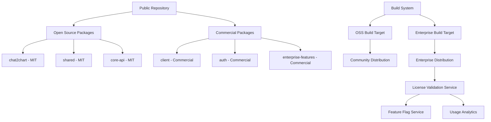
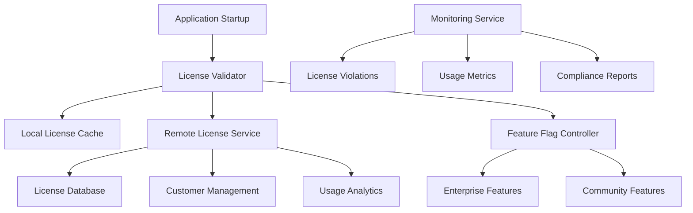

# Dual Licensing and Technical Enforcement Strategy Design Document

## Overview

This design document outlines the architecture and implementation approach for a comprehensive dual licensing strategy with technical enforcement mechanisms. The design enables open source community engagement while protecting commercial intellectual property through legal frameworks and technical controls, following successful patterns from GitLab, Superset, and other dual-licensed platforms.

## Architecture

### High-Level System Architecture



### License Enforcement Architecture



## Components and Interfaces

### 1. License Validation Service

**Purpose**: Centralized license validation and feature entitlement management

**Key Components**:
- License key validation
- Feature flag management
- Usage tracking and analytics
- Customer entitlement management

**Interface**:
```typescript
interface LicenseValidator {
  validateLicense(licenseKey: string): Promise<LicenseValidationResult>;
  getFeatureFlags(customerId: string): Promise<FeatureFlags>;
  trackUsage(event: UsageEvent): Promise<void>;
  refreshLicense(licenseKey: string): Promise<LicenseInfo>;
}

interface LicenseValidationResult {
  valid: boolean;
  customerId: string;
  tier: 'community' | 'professional' | 'enterprise' | 'custom';
  features: string[];
  expiresAt: Date;
  restrictions: LicenseRestriction[];
}

interface FeatureFlags {
  [featureName: string]: {
    enabled: boolean;
    config: FeatureConfig;
    restrictions: FeatureRestriction[];
  };
}
```

### 2. Build System and Distribution

**Purpose**: Create separate distributions for open source and enterprise versions

**Key Components**:
- Package filtering based on license
- Conditional compilation
- Asset optimization
- Distribution packaging

**Interface**:
```typescript
interface BuildConfiguration {
  target: 'oss' | 'enterprise';
  packages: PackageConfig[];
  features: FeatureConfig[];
  assets: AssetConfig[];
}

interface PackageConfig {
  name: string;
  license: 'MIT' | 'Commercial';
  includeInOSS: boolean;
  includeInEnterprise: boolean;
  dependencies: string[];
}

interface DistributionBuilder {
  buildOSSVersion(config: BuildConfiguration): Promise<BuildArtifact>;
  buildEnterpriseVersion(config: BuildConfiguration): Promise<BuildArtifact>;
  validateLicenseCompliance(artifact: BuildArtifact): Promise<ComplianceReport>;
}
```

### 3. Feature Flag System

**Purpose**: Runtime control of feature availability based on license tier

**Key Components**:
- Remote configuration service
- Local feature flag cache
- Gradual rollout capabilities
- A/B testing integration

**Interface**:
```typescript
interface FeatureFlagService {
  isFeatureEnabled(featureName: string, context: FeatureContext): Promise<boolean>;
  getFeatureConfig(featureName: string): Promise<FeatureConfig>;
  updateFeatureFlags(customerId: string, flags: FeatureFlags): Promise<void>;
  trackFeatureUsage(featureName: string, context: FeatureContext): Promise<void>;
}

interface FeatureContext {
  customerId: string;
  userId: string;
  tier: LicenseTier;
  environment: 'development' | 'staging' | 'production';
  metadata: Record<string, any>;
}

interface FeatureConfig {
  enabled: boolean;
  rolloutPercentage: number;
  restrictions: FeatureRestriction[];
  config: Record<string, any>;
}
```

### 4. Contribution Management System

**Purpose**: Manage open source contributions while protecting commercial interests

**Key Components**:
- CLA automation
- Code ownership management
- Contribution validation
- License compliance checking

**Interface**:
```typescript
interface ContributionManager {
  validateContribution(pr: PullRequest): Promise<ContributionValidation>;
  checkCLAStatus(contributor: Contributor): Promise<CLAStatus>;
  assignReviewers(pr: PullRequest): Promise<Reviewer[]>;
  validateLicenseCompliance(changes: CodeChange[]): Promise<ComplianceCheck>;
}

interface ContributionValidation {
  valid: boolean;
  issues: ValidationIssue[];
  requiredActions: RequiredAction[];
  reviewers: Reviewer[];
}

interface CLAStatus {
  signed: boolean;
  signedAt?: Date;
  version: string;
  needsUpdate: boolean;
}
```

## Data Models

### License Management

```typescript
interface License {
  id: string;
  customerId: string;
  licenseKey: string;
  tier: LicenseTier;
  features: string[];
  restrictions: LicenseRestriction[];
  issuedAt: Date;
  expiresAt: Date;
  status: 'active' | 'expired' | 'suspended' | 'revoked';
  metadata: LicenseMetadata;
}

interface LicenseRestriction {
  type: 'user_limit' | 'data_limit' | 'feature_limit' | 'time_limit';
  value: number | string;
  description: string;
}

interface Customer {
  id: string;
  name: string;
  tier: LicenseTier;
  licenses: License[];
  usage: UsageMetrics;
  support: SupportLevel;
  billing: BillingInfo;
}
```

### Feature Management

```typescript
interface Feature {
  name: string;
  description: string;
  category: 'core' | 'analytics' | 'collaboration' | 'enterprise';
  requiredTier: LicenseTier;
  dependencies: string[];
  restrictions: FeatureRestriction[];
  rolloutConfig: RolloutConfig;
}

interface FeatureRestriction {
  type: 'user_count' | 'data_volume' | 'api_calls' | 'concurrent_sessions';
  limit: number;
  period?: 'hour' | 'day' | 'month';
  enforcement: 'hard' | 'soft' | 'warning';
}

interface RolloutConfig {
  enabled: boolean;
  percentage: number;
  targetAudience: string[];
  startDate: Date;
  endDate?: Date;
}
```

### Usage Analytics

```typescript
interface UsageEvent {
  eventId: string;
  customerId: string;
  userId: string;
  featureName: string;
  eventType: 'access' | 'usage' | 'error' | 'violation';
  timestamp: Date;
  metadata: Record<string, any>;
  context: UsageContext;
}

interface UsageMetrics {
  customerId: string;
  period: TimePeriod;
  features: FeatureUsage[];
  users: UserUsage[];
  violations: LicenseViolation[];
  summary: UsageSummary;
}

interface FeatureUsage {
  featureName: string;
  accessCount: number;
  uniqueUsers: number;
  averageSessionDuration: number;
  errorRate: number;
}
```

## Error Handling

### License Validation Errors

```typescript
interface LicenseErrorHandler {
  handleInvalidLicense(error: InvalidLicenseError): EnforcementAction;
  handleExpiredLicense(error: ExpiredLicenseError): EnforcementAction;
  handleNetworkError(error: NetworkError): EnforcementAction;
  handleServiceUnavailable(error: ServiceError): EnforcementAction;
}

interface EnforcementAction {
  type: 'block' | 'degrade' | 'warn' | 'log';
  message: string;
  fallbackBehavior: FallbackBehavior;
  retryPolicy: RetryPolicy;
}

interface FallbackBehavior {
  enableOSSFeatures: boolean;
  showWarningBanner: boolean;
  limitFunctionality: boolean;
  gracePeriod: number; // hours
}
```

### Feature Access Errors

```typescript
interface FeatureAccessError extends Error {
  featureName: string;
  requiredTier: LicenseTier;
  currentTier: LicenseTier;
  upgradeUrl: string;
  contactInfo: string;
}

interface FeatureErrorHandler {
  handleUnauthorizedAccess(error: FeatureAccessError): void;
  handleQuotaExceeded(error: QuotaError): void;
  handleFeatureDisabled(error: FeatureDisabledError): void;
}
```

## Testing Strategy

### License System Testing

```typescript
interface LicenseTestSuite {
  testValidLicenseValidation(): Promise<void>;
  testExpiredLicenseHandling(): Promise<void>;
  testInvalidLicenseHandling(): Promise<void>;
  testOfflineLicenseValidation(): Promise<void>;
  testFeatureFlagIntegration(): Promise<void>;
  testUsageTracking(): Promise<void>;
}

interface SecurityTestSuite {
  testLicenseKeyTampering(): Promise<void>;
  testBypassAttempts(): Promise<void>;
  testEncryptionIntegrity(): Promise<void>;
  testAPISecurityHeaders(): Promise<void>;
}
```

### Build System Testing

```typescript
interface BuildTestSuite {
  testOSSBuildExcludesCommercialCode(): Promise<void>;
  testEnterpriseBuildIncludesAllFeatures(): Promise<void>;
  testLicenseHeaderValidation(): Promise<void>;
  testDependencyLicenseCompliance(): Promise<void>;
}
```

## Security Considerations

### License Key Security

```typescript
interface LicenseKeySecurity {
  generateSecureKey(customerId: string, tier: LicenseTier): string;
  validateKeyIntegrity(licenseKey: string): boolean;
  encryptKeyForStorage(licenseKey: string): string;
  decryptKeyFromStorage(encryptedKey: string): string;
}

interface AntiTamperingMeasures {
  obfuscateCommercialCode(): void;
  validateCodeIntegrity(): boolean;
  detectDebuggingAttempts(): boolean;
  implementRuntimeChecks(): void;
}
```

### Communication Security

```typescript
interface SecureCommunication {
  establishSecureChannel(): SecureChannel;
  validateServerCertificate(): boolean;
  encryptLicenseRequest(request: LicenseRequest): EncryptedRequest;
  decryptLicenseResponse(response: EncryptedResponse): LicenseResponse;
}

interface SecureChannel {
  encrypt(data: any): EncryptedData;
  decrypt(encryptedData: EncryptedData): any;
  sign(data: any): Signature;
  verify(data: any, signature: Signature): boolean;
}
```

## Performance Considerations

### License Validation Performance

```typescript
interface LicenseCache {
  get(licenseKey: string): Promise<CachedLicense | null>;
  set(licenseKey: string, license: License, ttl: number): Promise<void>;
  invalidate(licenseKey: string): Promise<void>;
  refresh(licenseKey: string): Promise<License>;
}

interface PerformanceOptimizations {
  batchLicenseValidation(keys: string[]): Promise<ValidationResult[]>;
  preloadFeatureFlags(customerId: string): Promise<void>;
  optimizeNetworkCalls(): void;
  implementCircuitBreaker(): CircuitBreaker;
}
```

### Scalability Considerations

```typescript
interface ScalabilityDesign {
  implementLoadBalancing(): LoadBalancer;
  setupDatabaseSharding(): ShardingStrategy;
  configureCDNDistribution(): CDNConfig;
  implementRateLimiting(): RateLimiter;
}

interface HighAvailabilitySetup {
  setupFailoverMechanisms(): FailoverConfig;
  implementHealthChecks(): HealthCheck[];
  configureBackupSystems(): BackupStrategy;
  setupMonitoringAlerts(): AlertConfig[];
}
```

## Compliance and Audit

### Audit Trail System

```typescript
interface AuditTrail {
  logLicenseValidation(event: LicenseValidationEvent): Promise<void>;
  logFeatureAccess(event: FeatureAccessEvent): Promise<void>;
  logViolationAttempt(event: ViolationEvent): Promise<void>;
  generateComplianceReport(period: TimePeriod): Promise<ComplianceReport>;
}

interface ComplianceReport {
  period: TimePeriod;
  licenseValidations: number;
  featureAccesses: number;
  violations: ViolationSummary[];
  customerUsage: CustomerUsageSummary[];
  recommendations: ComplianceRecommendation[];
}
```

### Legal Compliance

```typescript
interface LegalCompliance {
  validateLicenseTerms(license: License): ComplianceCheck;
  checkContributorAgreements(contributor: Contributor): CLAStatus;
  auditOpenSourceCompliance(): OSComplianceReport;
  generateLegalReport(customerId: string): LegalReport;
}

interface OSComplianceReport {
  dependencies: DependencyLicense[];
  licenseConflicts: LicenseConflict[];
  attributionRequirements: Attribution[];
  recommendations: ComplianceRecommendation[];
}
```