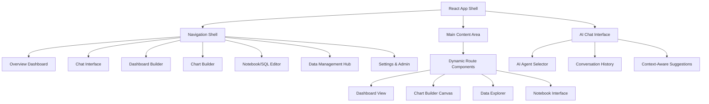

# Enhanced Platform UX/UI Design Document

## Overview

This design document outlines the architecture and implementation approach for transforming the Aiser Platform into a comprehensive business intelligence platform that competes with PowerBI, Tableau, and Superset. The design focuses on creating an intuitive, powerful, and scalable user experience with AI-driven insights and comprehensive data management capabilities.

## Architecture

### Frontend Architecture



### Component Hierarchy

```
App Shell
├── Navigation Sidebar
│   ├── Overview Section
│   ├── Analytics Section
│   │   ├── Chat Interface
│   │   ├── Dashboard Builder
│   │   └── Chart Builder
│   ├── Development Section
│   │   ├── SQL Editor
│   │   ├── Python Notebooks
│   │   └── API Builder
│   ├── Data Section
│   │   ├── Connections
│   │   ├── File Upload
│   │   ├── Data Catalog
│   │   └── Quality Monitoring
│   └── Collaboration Section
│       ├── Workspaces
│       ├── Shared Content
│       └── Team Management
├── Main Content Area
│   ├── Route-based Components
│   ├── Context Panels
│   └── Modal Overlays
└── AI Assistant Panel
    ├── Agent Selection
    ├── Chat Interface
    └── Insight Recommendations
```

## Components and Interfaces

### 1. Navigation Sidebar Component

**Purpose**: Provide comprehensive navigation with role-based menu customization

**Key Features**:
- Collapsible/expandable sections
- Role-based visibility controls
- Drag-and-drop menu customization
- Search functionality
- Recent items and favorites

**Interface**:
```typescript
interface NavigationConfig {
  sections: NavigationSection[];
  userRole: UserRole;
  customization: MenuCustomization;
}

interface NavigationSection {
  id: string;
  title: string;
  icon: string;
  items: NavigationItem[];
  collapsed: boolean;
  permissions: Permission[];
}
```

### 2. Overview Dashboard Component

**Purpose**: Provide executive-level insights and KPI monitoring

**Key Features**:
- Personalized KPI cards
- AI-generated insights
- Anomaly detection alerts
- Drill-down capabilities
- Customizable widget layout

**Interface**:
```typescript
interface OverviewDashboard {
  widgets: DashboardWidget[];
  insights: AIInsight[];
  alerts: Alert[];
  layout: GridLayout;
}

interface DashboardWidget {
  id: string;
  type: 'kpi' | 'chart' | 'insight' | 'alert';
  config: WidgetConfig;
  position: GridPosition;
}
```

### 3. Enhanced Chat Interface

**Purpose**: Provide natural language interaction with specialized AI agents

**Key Features**:
- Multiple AI agent personas
- Context-aware responses
- Visual result integration
- Conversation management
- Voice input support

**Interface**:
```typescript
interface ChatInterface {
  agents: AIAgent[];
  conversations: Conversation[];
  currentContext: AnalysisContext;
}

interface AIAgent {
  id: string;
  name: string;
  persona: 'analyst' | 'consultant' | 'technical';
  capabilities: string[];
  model: string;
}
```

### 4. Advanced Dashboard Builder

**Purpose**: Provide drag-and-drop dashboard creation with professional layouts

**Key Features**:
- Component library
- Responsive grid system
- Interactive configuration
- Template gallery
- Real-time preview

**Interface**:
```typescript
interface DashboardBuilder {
  canvas: DashboardCanvas;
  componentLibrary: ComponentLibrary;
  properties: PropertyPanel;
  preview: PreviewMode;
}

interface DashboardCanvas {
  layout: ResponsiveLayout;
  components: DashboardComponent[];
  interactions: ComponentInteraction[];
}
```

### 5. Chart Builder with AntV Integration

**Purpose**: Create sophisticated visualizations using AntV libraries

**Key Features**:
- Intelligent chart recommendations
- Statistical visualizations (G2)
- Network diagrams (G6)
- Geospatial maps (L7)
- Process flows (X6)
- Pivot tables (S2)

**Interface**:
```typescript
interface ChartBuilder {
  dataSource: DataSource;
  chartType: ChartType;
  configuration: ChartConfig;
  antVIntegration: AntVConfig;
}

interface AntVConfig {
  library: 'G2' | 'G6' | 'L7' | 'X6' | 'S2';
  advancedFeatures: AdvancedFeature[];
  interactivity: InteractionConfig;
}
```

### 6. Unified Data Management Hub

**Purpose**: Centralize all data source management and monitoring

**Key Features**:
- Connection wizards
- Data profiling
- Quality monitoring
- Refresh scheduling
- API management

**Interface**:
```typescript
interface DataHub {
  connections: DataConnection[];
  files: FileUpload[];
  apis: APIConnection[];
  monitoring: DataQualityMetrics;
}

interface DataConnection {
  id: string;
  type: 'database' | 'warehouse' | 'api' | 'file';
  config: ConnectionConfig;
  status: ConnectionStatus;
  metrics: ConnectionMetrics;
}
```

## Data Models

### User Preferences and Personalization

```typescript
interface UserPreferences {
  userId: string;
  navigation: NavigationPreferences;
  dashboard: DashboardPreferences;
  ai: AIPreferences;
  notifications: NotificationPreferences;
}

interface NavigationPreferences {
  sidebarCollapsed: boolean;
  menuOrder: string[];
  hiddenItems: string[];
  favorites: string[];
}
```

### Workspace and Collaboration

```typescript
interface Workspace {
  id: string;
  name: string;
  description: string;
  members: WorkspaceMember[];
  dashboards: Dashboard[];
  datasets: Dataset[];
  permissions: WorkspacePermissions;
}

interface WorkspaceMember {
  userId: string;
  role: 'owner' | 'admin' | 'editor' | 'viewer';
  permissions: Permission[];
  joinedAt: Date;
}
```

### AI Insights and Recommendations

```typescript
interface AIInsight {
  id: string;
  type: 'anomaly' | 'trend' | 'recommendation' | 'forecast';
  title: string;
  description: string;
  confidence: number;
  data: InsightData;
  actions: RecommendedAction[];
  createdAt: Date;
}

interface RecommendedAction {
  id: string;
  title: string;
  description: string;
  type: 'investigate' | 'alert' | 'automate' | 'share';
  priority: 'low' | 'medium' | 'high' | 'critical';
}
```

## Error Handling

### Global Error Boundary

```typescript
interface ErrorBoundaryState {
  hasError: boolean;
  error: Error | null;
  errorInfo: ErrorInfo | null;
  retryCount: number;
}

class GlobalErrorBoundary extends Component<Props, ErrorBoundaryState> {
  // Comprehensive error handling with user-friendly messages
  // Automatic retry mechanisms for transient errors
  // Error reporting to monitoring systems
  // Graceful degradation for non-critical features
}
```

### API Error Handling

```typescript
interface APIErrorHandler {
  handleNetworkError(error: NetworkError): void;
  handleAuthenticationError(error: AuthError): void;
  handleValidationError(error: ValidationError): void;
  handleServerError(error: ServerError): void;
}
```

## Testing Strategy

### Component Testing

- **Unit Tests**: Jest + React Testing Library for all components
- **Integration Tests**: Test component interactions and data flow
- **Visual Regression Tests**: Chromatic for UI consistency
- **Accessibility Tests**: axe-core for WCAG compliance

### End-to-End Testing

- **User Workflows**: Playwright tests for complete user journeys
- **Cross-browser Testing**: Automated testing across major browsers
- **Mobile Testing**: Responsive design validation
- **Performance Testing**: Lighthouse CI for performance metrics

### AI and Data Testing

- **AI Response Testing**: Validate AI agent responses and recommendations
- **Data Pipeline Testing**: Test data ingestion and transformation
- **Chart Rendering Testing**: Validate visualization accuracy
- **Real-time Updates**: Test live data refresh and notifications

## Performance Considerations

### Frontend Optimization

- **Code Splitting**: Route-based and component-based lazy loading
- **Virtual Scrolling**: For large datasets and lists
- **Memoization**: React.memo and useMemo for expensive computations
- **Bundle Optimization**: Tree shaking and dynamic imports

### Data Handling

- **Caching Strategy**: Multi-level caching (browser, CDN, server)
- **Progressive Loading**: Load data incrementally for large datasets
- **Query Optimization**: Intelligent query batching and deduplication
- **Real-time Updates**: WebSocket connections with efficient data streaming

### Rendering Performance

- **Chart Optimization**: Canvas-based rendering for complex visualizations
- **DOM Optimization**: Minimize DOM manipulations and reflows
- **Memory Management**: Proper cleanup of event listeners and subscriptions
- **Mobile Optimization**: Touch-optimized interactions and gestures

## Security Considerations

### Frontend Security

- **XSS Prevention**: Content Security Policy and input sanitization
- **Authentication**: Secure token handling and automatic refresh
- **Authorization**: Role-based access control for UI components
- **Data Protection**: Encryption of sensitive data in local storage

### API Security

- **HTTPS Enforcement**: All API communications over HTTPS
- **Token Validation**: JWT token validation and refresh mechanisms
- **Rate Limiting**: Client-side rate limiting for API calls
- **Error Handling**: Secure error messages without sensitive information

## Accessibility

### WCAG 2.1 AA Compliance

- **Keyboard Navigation**: Full keyboard accessibility for all features
- **Screen Reader Support**: Proper ARIA labels and semantic HTML
- **Color Contrast**: Minimum 4.5:1 contrast ratio for all text
- **Focus Management**: Clear focus indicators and logical tab order

### Inclusive Design

- **Responsive Design**: Mobile-first approach with flexible layouts
- **Internationalization**: Support for multiple languages and RTL layouts
- **Reduced Motion**: Respect user preferences for motion and animations
- **High Contrast Mode**: Support for high contrast and dark themes