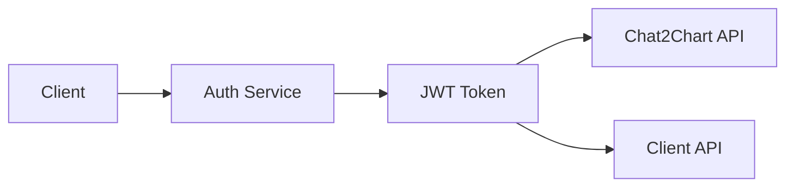
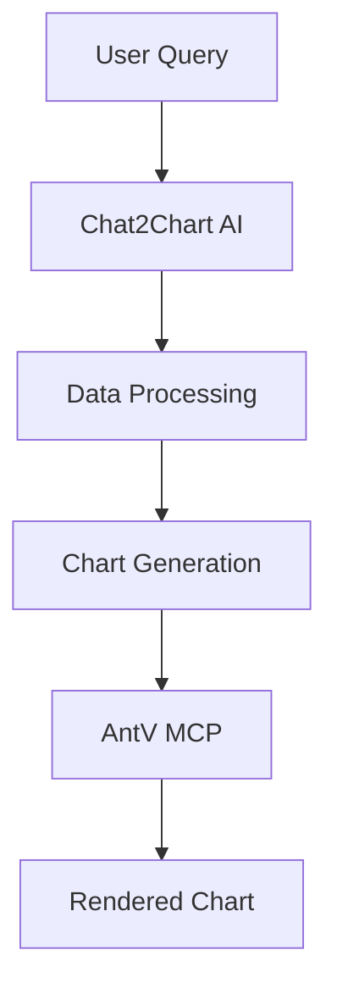

# Aiser Platform - AI-Powered Analytics Platform

Aiser Platform is a world-class AI-powered alternative to BI Tools designed for individuals and enterprises, featuring an open source core with integrated GenAI tooling and deep AntV MCP integration.

## 🏗️ Architecture Overview

Aiser Platform consists of multiple interconnected components in a unified monorepo:

- **🤖 Chat2Chart**: Core AI-powered chart generation engine (Open Source)
- **💼 Client**: Enterprise frontend application with advanced features
- **🔐 Authentication**: Centralized authentication and authorization service
- **📊 Shared**: Common utilities, types, and components
- **🛠️ Tools**: Development and deployment utilities

## 📁 Project Structure

```
aiser-platform/
├── packages/
│   ├── chat2chart/          # AI chart generation (Next.js + FastAPI)
│   │   ├── client/          # Next.js frontend
│   │   └── server/          # FastAPI backend
│   ├── client/              # Enterprise client application
│   │   ├── client/          # Next.js frontend
│   │   └── server/          # FastAPI backend
│   ├── auth/                # Authentication service (FastAPI)
│   └── shared/              # Shared utilities and types
├── docs/                    # Documentation and analysis
├── scripts/                 # Development scripts
└── tools/                   # Build and setup tools
```

## 🚀 Quick Start

### Prerequisites

- **Node.js** 18+ and npm 9+
- **Python** 3.11+ with pip
- **PostgreSQL** 15+ (for databases)
- **Redis** 7+ (for caching, optional)

### Installation

```bash
# Clone the repository
git clone <repository-url>
cd aiser-platform

# Install all dependencies
npm install

# Build shared package
npm run build

# Set up environment variables
cp packages/auth/.env.example packages/auth/.env
cp packages/chat2chart/server/.env.example packages/chat2chart/server/.env
# Update .env files with your configuration
```

### Development

```bash
# Start all services with Docker
./scripts/dev.sh docker

# Or start individual services
./scripts/dev.sh chat2chart  # AI chart generation
./scripts/dev.sh client      # Enterprise client
./scripts/dev.sh auth        # Authentication service

# Check service status
./scripts/dev.sh status
```

### Test User Credentials

For development and testing, you can create a test user:

```bash
# Create test user
./scripts/create-test-user.sh
```

**Test User Credentials:**
- **Email**: `test@dataticon.com`
- **Username**: `testuser`
- **Password**: `testpassword123`

**Service URLs:**
- 📊 Chat2Chart Frontend: http://localhost:3000
- 🔌 Chat2Chart API: http://localhost:8000
- 🔐 Auth API: http://localhost:5000
- 🗄️ PostgreSQL: localhost:5432
- 🔴 Redis: localhost:6379

### Available Scripts

```bash
# Development
npm run dev                  # Start all services
npm run dev:chat2chart      # Start Chat2Chart client only
npm run dev:client          # Start enterprise client only

# Building
npm run build               # Build all packages
npm run build:chat2chart    # Build Chat2Chart client
npm run build:client        # Build enterprise client

# Testing
npm run test                # Run all tests
npm run test:unit           # Run unit tests
npm run test:integration    # Run integration tests

# Code Quality
npm run lint                # Lint all packages
npm run lint:fix            # Fix linting issues
npm run format              # Format code with Prettier
npm run typecheck           # TypeScript type checking
```

## 🔧 Development Workflow

### Monorepo Structure

This project uses npm workspaces for monorepo management:

- **Shared Dependencies**: Common dependencies are hoisted to the root
- **Package Isolation**: Each package has its own dependencies and scripts
- **Cross-Package Imports**: Use `@aiser/shared` for shared utilities

### Code Quality

- **ESLint**: Consistent code style across all packages
- **Prettier**: Automatic code formatting
- **TypeScript**: Type safety for JavaScript/TypeScript code
- **Husky**: Git hooks for pre-commit checks
- **Lint-staged**: Run linters on staged files only

### Testing Strategy

- **Unit Tests**: Jest for individual component testing
- **Integration Tests**: Cross-service communication testing
- **E2E Tests**: Full user workflow testing (planned)

## 🏛️ Architecture Principles

### Open Source Core + Enterprise Features

- **Chat2Chart**: Open source AI chart generation
- **Enterprise Client**: Advanced features, collaboration, governance
- **Authentication**: Split between basic (open source) and enterprise (SSO, MFA)

### AI-First Design

- **LiteLLM Integration**: Support for multiple AI models (GPT-4.1-mini, Gemini 2.5, local)
- **Multi-Agent System**: Specialized AI agents for different tasks
- **Conversation Memory**: Persistent context across interactions

### Scalable Architecture

- **Microservices**: Independent, scalable services
- **API-First**: RESTful APIs with OpenAPI documentation
- **Database Per Service**: Each service manages its own data
- **Shared Utilities**: Common code in `@aiser/shared` package

## 🔌 Service Integration

### Authentication Flow



### Data Flow



## 📊 Technology Stack

### Frontend
- **Next.js 14**: React framework with App Router
- **TypeScript**: Type-safe JavaScript
- **Tailwind CSS**: Utility-first CSS framework
- **Ant Design**: Enterprise UI components
- **ECharts/AntV**: Chart visualization libraries

### Backend
- **FastAPI**: Modern Python web framework
- **SQLAlchemy**: Python SQL toolkit and ORM
- **PostgreSQL**: Primary database
- **Redis**: Caching and session storage
- **Alembic**: Database migrations

### AI/ML
- **LiteLLM**: Multi-model AI orchestration
- **OpenAI GPT-4.1-mini**: Primary AI model
- **Google Gemini 2.5**: Alternative AI model
- **Local Models**: Self-hosted AI capabilities

### DevOps
- **Docker**: Containerization
- **Kubernetes**: Container orchestration
- **GitHub Actions**: CI/CD pipeline
- **Monitoring**: Application performance monitoring

## 🤝 Contributing

1. **Fork** the repository
2. **Create** a feature branch (`git checkout -b feature/amazing-feature`)
3. **Commit** your changes (`git commit -m 'Add amazing feature'`)
4. **Push** to the branch (`git push origin feature/amazing-feature`)
5. **Open** a Pull Request

### Development Guidelines

- Follow the existing code style (ESLint + Prettier)
- Write tests for new features
- Update documentation as needed
- Use conventional commit messages

## 📄 License

Aiser uses a **dual-licensing model**:

### 🆓 Open Source Components (MIT License)
- **Chat2Chart Core**: AI chart generation engine
- **Shared Utilities**: Common types and utilities
- **Basic Authentication**: JWT-based auth utilities

### 💼 Enterprise Components (Commercial License)
- **Enterprise Client**: Advanced UI, collaboration, dashboards
- **Enterprise Auth**: SSO, SAML, MFA, advanced RBAC
- **Advanced Features**: AntV MCP, database connectors, predictive analytics

**Evaluation**: Enterprise features available for 30-day evaluation.  
**Commercial Licensing**: Contact support@dataticon.com

### 📋 **Enterprise Documentation**
- **[Enterprise License Agreement](ENTERPRISE-LICENSE-AGREEMENT.md)** - Complete legal terms
- **[Evaluation Terms](EVALUATION-TERMS.md)** - 30-day trial terms
- **[Pricing Guide](PRICING-AND-LICENSING.md)** - Plans and pricing
- **[Compliance & Security](COMPLIANCE-AND-SECURITY.md)** - SOC 2, GDPR, HIPAA

See the [LICENSE](LICENSE) file for complete details.

## 🆘 Support

- **Documentation**: Check the `packages/docs/` directory
- **Issues**: Report bugs and request features via GitHub Issues
- **Email Support**: support@dataticon.com
- **Discussions**: Join community discussions

---


**Built with ❤️ by DataTicon Team**


