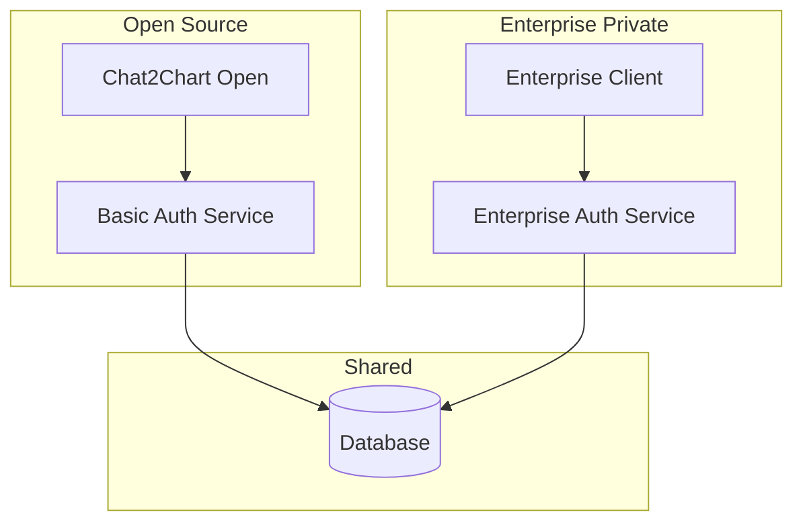
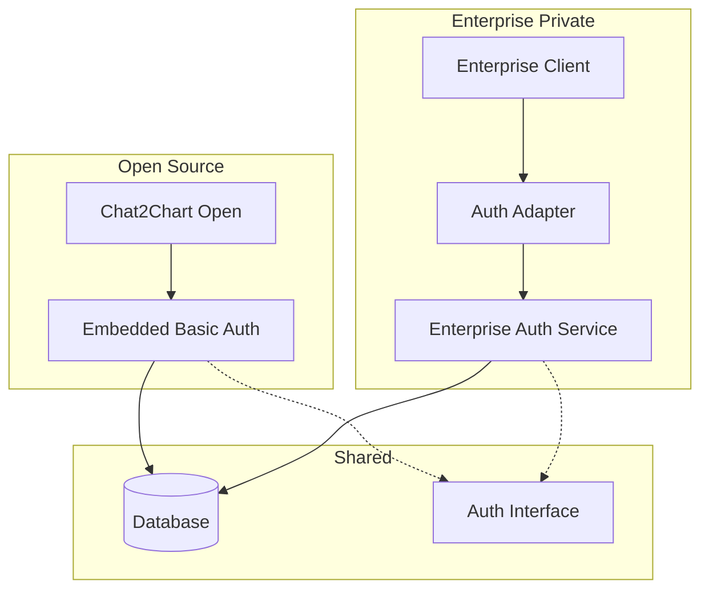

# Authentication Architecture Strategy

## Current Situation Analysis

### **Existing Setup**
- **Authentication Service**: Separate private repository with full auth implementation
- **Chat2Chart**: Currently calls external auth service
- **Client**: Also calls the same auth service

### **The Strategic Question**
How to split authentication between open source and enterprise while maintaining clean architecture?

## Architecture Options

### **Option 1: Microservice Approach (Current + Enhanced)**



**Implementation:**
```typescript
// Open Source: Basic Auth Service
class BasicAuthService {
  async login(email: string, password: string): Promise<AuthResult>
  async register(userData: UserData): Promise<User>
  async validateToken(token: string): Promise<User | null>
  async logout(token: string): Promise<void>
}

// Enterprise: Extended Auth Service
class EnterpriseAuthService extends BasicAuthService {
  async loginWithSSO(provider: string): Promise<AuthResult>
  async enableMFA(userId: string): Promise<void>
  async manageRoles(userId: string, roles: Role[]): Promise<void>
  async auditLogin(userId: string, metadata: AuditData): Promise<void>
}
```

### **Option 2: Embedded Basic Auth (Recommended)**



**Why This is Better:**
- Open source is self-contained (easier adoption)
- Enterprise can override/extend authentication
- Clean separation of concerns
- No dependency on external services for basic usage

## Detailed Implementation Strategy

### **Step 1: Create Auth Interface (Shared)**

```typescript
// packages/shared/auth-interface.ts
export interface AuthProvider {
  // Core authentication methods
  login(credentials: LoginCredentials): Promise<AuthResult>
  logout(token: string): Promise<void>
  validateToken(token: string): Promise<User | null>
  refreshToken(refreshToken: string): Promise<AuthResult>
  
  // User management
  getCurrentUser(token: string): Promise<User | null>
  updateUser(userId: string, updates: UserUpdates): Promise<User>
  
  // Basic permissions
  hasPermission(userId: string, permission: string): Promise<boolean>
}

export interface AuthResult {
  user: User
  accessToken: string
  refreshToken: string
  expiresIn: number
}

export interface User {
  id: string
  email: string
  name: string
  roles: string[]
  permissions: string[]
  createdAt: Date
  updatedAt: Date
}
```

### **Step 2: Basic Auth Implementation (Open Source)**

```typescript
// packages/chat2chart/src/auth/basic-auth-provider.ts
import { AuthProvider, AuthResult, User } from '@aiser/auth-interface'
import jwt from 'jsonwebtoken'
import bcrypt from 'bcrypt'

export class BasicAuthProvider implements AuthProvider {
  constructor(
    private database: Database,
    private jwtSecret: string
  ) {}

  async login(credentials: LoginCredentials): Promise<AuthResult> {
    const user = await this.database.users.findByEmail(credentials.email)
    
    if (!user || !await bcrypt.compare(credentials.password, user.passwordHash)) {
      throw new Error('Invalid credentials')
    }

    const accessToken = jwt.sign(
      { userId: user.id, email: user.email },
      this.jwtSecret,
      { expiresIn: '1h' }
    )

    const refreshToken = jwt.sign(
      { userId: user.id, type: 'refresh' },
      this.jwtSecret,
      { expiresIn: '7d' }
    )

    return {
      user: this.mapToUser(user),
      accessToken,
      refreshToken,
      expiresIn: 3600
    }
  }

  async validateToken(token: string): Promise<User | null> {
    try {
      const payload = jwt.verify(token, this.jwtSecret) as any
      const user = await this.database.users.findById(payload.userId)
      return user ? this.mapToUser(user) : null
    } catch {
      return null
    }
  }

  async hasPermission(userId: string, permission: string): Promise<boolean> {
    // Basic role-based permissions
    const user = await this.database.users.findById(userId)
    return user?.roles.includes('admin') || user?.permissions.includes(permission)
  }

  // ... other basic methods
}
```

### **Step 3: Enterprise Auth Implementation (Private)**

```typescript
// packages/enterprise/src/auth/enterprise-auth-provider.ts
import { BasicAuthProvider } from '@aiser/chat2chart/auth'
import { SAMLProvider, OIDCProvider } from './sso-providers'

export class EnterpriseAuthProvider extends BasicAuthProvider {
  constructor(
    database: Database,
    jwtSecret: string,
    private samlProvider: SAMLProvider,
    private oidcProvider: OIDCProvider,
    private auditLogger: AuditLogger
  ) {
    super(database, jwtSecret)
  }

  async loginWithSSO(provider: string, token: string): Promise<AuthResult> {
    let userInfo: SSOUserInfo
    
    switch (provider) {
      case 'saml':
        userInfo = await this.samlProvider.validateToken(token)
        break
      case 'oidc':
        userInfo = await this.oidcProvider.validateToken(token)
        break
      default:
        throw new Error(`Unsupported SSO provider: ${provider}`)
    }

    // Create or update user from SSO
    const user = await this.createOrUpdateSSOUser(userInfo)
    
    // Audit the login
    await this.auditLogger.logLogin(user.id, {
      method: 'sso',
      provider,
      ip: userInfo.ip,
      userAgent: userInfo.userAgent
    })

    return this.generateTokens(user)
  }

  async enableMFA(userId: string, method: MFAMethod): Promise<void> {
    const user = await this.database.users.findById(userId)
    if (!user) throw new Error('User not found')

    await this.database.users.update(userId, {
      mfaEnabled: true,
      mfaMethod: method,
      mfaSecret: this.generateMFASecret()
    })

    await this.auditLogger.logSecurityChange(userId, 'mfa_enabled', { method })
  }

  async hasPermission(userId: string, permission: string): Promise<boolean> {
    // Enhanced RBAC with hierarchical permissions
    const user = await this.database.users.findById(userId)
    if (!user) return false

    // Check direct permissions
    if (user.permissions.includes(permission)) return true

    // Check role-based permissions with hierarchy
    for (const roleId of user.roleIds) {
      const role = await this.database.roles.findById(roleId)
      if (role && this.roleHasPermission(role, permission)) {
        return true
      }
    }

    return false
  }

  private async roleHasPermission(role: Role, permission: string): Promise<boolean> {
    // Check direct role permissions
    if (role.permissions.includes(permission)) return true

    // Check inherited permissions from parent roles
    for (const parentRoleId of role.parentRoles) {
      const parentRole = await this.database.roles.findById(parentRoleId)
      if (parentRole && await this.roleHasPermission(parentRole, permission)) {
        return true
      }
    }

    return false
  }
}
```

### **Step 4: Integration Pattern**

```typescript
// packages/chat2chart/src/app.ts (Open Source)
import { BasicAuthProvider } from './auth/basic-auth-provider'

const authProvider = new BasicAuthProvider(database, process.env.JWT_SECRET)

app.use('/api', createAuthMiddleware(authProvider))
```

```typescript
// packages/enterprise-client/src/app.ts (Enterprise)
import { EnterpriseAuthProvider } from '@aiser/enterprise/auth'
import { BasicAuthProvider } from '@aiser/chat2chart/auth'

// Use enterprise auth if configured, fallback to basic
const authProvider = process.env.ENTERPRISE_MODE 
  ? new EnterpriseAuthProvider(database, jwtSecret, samlProvider, oidcProvider, auditLogger)
  : new BasicAuthProvider(database, jwtSecret)

app.use('/api', createAuthMiddleware(authProvider))
```

## Migration Strategy from Current Setup

### **Phase 1: Extract Basic Auth**
1. Copy basic auth functionality from private auth service
2. Embed it into Chat2Chart as `BasicAuthProvider`
3. Remove external auth service dependency for open source

### **Phase 2: Enhance Enterprise Auth**
1. Keep existing private auth service
2. Extend it with enterprise features (SSO, MFA, RBAC)
3. Create adapter pattern for enterprise client

### **Phase 3: Optimize**
1. Share common auth interface
2. Add comprehensive testing
3. Document authentication flows

## Best Practices Summary

### **✅ Recommended Approach**

1. **Embed Basic Auth in Open Source**
   - Self-contained, no external dependencies
   - Easy for developers to get started
   - JWT + local user management

2. **Extend with Enterprise Service**
   - Private repository with advanced features
   - SSO, SAML, OIDC integration
   - Advanced RBAC and audit logging

3. **Shared Interface**
   - Common auth interface for consistency
   - Easy to swap implementations
   - Clean separation of concerns

### **🔄 Migration Path**

```
Current: Chat2Chart → Auth Service ← Enterprise Client
Target:  Chat2Chart (Basic Auth) + Enterprise Client → Enterprise Auth Service
```

This approach gives you:
- ✅ Self-contained open source offering
- ✅ Advanced enterprise features
- ✅ Clean architecture
- ✅ Easy maintenance and scaling

The key insight is that **basic auth should be embedded** in the open source version for ease of adoption, while **enterprise auth remains a separate service** for advanced features and scalability.