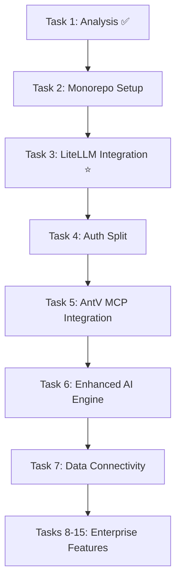

# Task List Reorganization Summary

## Issues Fixed

### ✅ **Numbering Conflicts Resolved**
- **Problem**: Two Task 3s (Authentication + LiteLLM)
- **Solution**: Sequential numbering with logical grouping

### ✅ **Priority Alignment**
- **Problem**: Task priorities didn't match analysis findings
- **Solution**: Reordered based on critical path and dependencies

## New Task Organization

### **Phase 1: Foundation (Weeks 1-4)**

**Task 1: Repository Analysis** ✅ **COMPLETED**
- 1.1 ✅ Aiser-Chat2Chart analysis (Production-ready)
- 1.2 ⏳ Aiser-Client analysis (Pending)
- 1.3 ✅ Authentication service analysis (Exceptionally well-built)
- 1.4 ✅ Integration strategy (Complete)

**Task 2: Monorepo Setup** 🔄 **NEXT**
- Unified development workflow
- Shared utilities and configurations
- Cross-service communication interfaces

**Task 3: LiteLLM Integration** ⭐ **CRITICAL PATH**
- Replace OpenAI direct calls with LiteLLM
- Azure OpenAI GPT-4.1-mini + Gemini 2.5 + local models
- Model routing and failover logic

**Task 4: Authentication Split** 🔐 **STRATEGIC**
- Extract basic JWT for open source Chat2Chart
- Enhance enterprise auth with SSO/SAML/MFA
- Keycloak integration for enterprise features

### **Phase 2: Competitive Features (Weeks 5-8)**

**Task 5: AntV MCP Integration** 📊 **COMPETITIVE ADVANTAGE**
- AntV MCP Server integration (https://github.com/antvis/mcp-server-chart)
- G2/G6/L7/X6/S2 advanced visualizations
- Intelligent chart recommendation system

**Task 6: Enhanced AI Engine** 🤖 **IMPROVEMENT**
- Improve existing NLP pipeline
- Better data analysis and recommendations
- AntV MCP integration for visualizations

**Task 7: Universal Data Connectivity** 🔌 **ESSENTIAL**
- Database connectors (PostgreSQL, MySQL, SQL Server)
- Cloud warehouses (Snowflake, BigQuery, Redshift)
- Real-time data streaming

### **Phase 3: Enterprise Differentiation (Weeks 9-12)**

**Tasks 8-15: Enterprise Features**
- Proactive analytics and insights
- Collaboration and governance
- Performance optimization
- Comprehensive testing
- Production deployment

## Key Changes Made

### **Removed Redundancies**
- ~~Duplicate authentication tasks~~
- ~~Overlapping AI integration tasks~~
- ~~Conflicting task numbers~~

### **Enhanced Priorities**
- **LiteLLM Integration** → Task 3 (Critical Path)
- **AntV MCP** → Task 5 (Competitive Advantage)
- **Authentication Split** → Task 4 (Strategic)

### **Logical Grouping**
- **Foundation** → Tasks 1-4 (Core infrastructure)
- **Competitive** → Tasks 5-7 (PowerBI competition)
- **Enterprise** → Tasks 8-15 (Differentiation)

## Critical Path Dependencies

## Success Metrics

### **Phase 1 Success**
- ✅ All repositories analyzed and integrated
- ✅ LiteLLM working with Azure OpenAI GPT-4.1-mini
- ✅ Basic auth extracted for open source
- ✅ Enterprise auth enhanced with SSO

### **Phase 2 Success**
- ✅ AntV MCP producing advanced visualizations
- ✅ Database connectors working
- ✅ Enhanced AI recommendations

### **Phase 3 Success**
- ✅ Enterprise features competitive with PowerBI
- ✅ Production deployment ready
- ✅ Comprehensive testing coverage

## Next Steps

**Immediate Actions:**
1. **Complete Task 1.2** - Analyze Aiser-Client repository
2. **Start Task 2** - Set up monorepo infrastructure
3. **Prepare Task 3** - Plan LiteLLM integration strategy

**Resource Allocation:**
- **Week 1-2**: Monorepo setup + LiteLLM planning
- **Week 3-4**: LiteLLM implementation + testing
- **Week 5-6**: Authentication split + AntV MCP setup
- **Week 7-8**: Data connectivity + AI enhancements

The reorganized task list now provides a clear, sequential path to building a PowerBI-competitive platform while leveraging the excellent existing codebase.