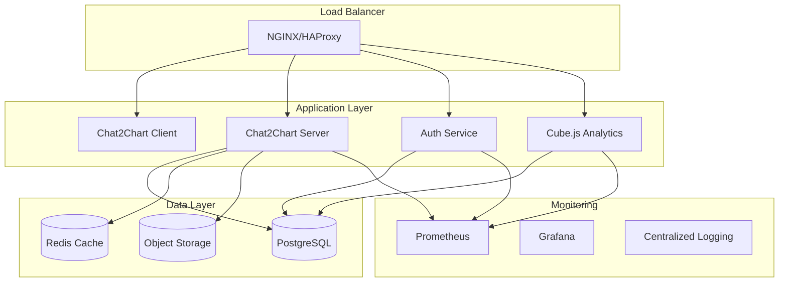

# 🏠 Self-Host & Enterprise Deployment

**Deploy Aicser Platform in your own infrastructure with enterprise-grade security, scalability, and customization.**

Self-hosting Aicser Platform gives you complete control over your data, infrastructure, and deployment while maintaining all the AI-powered analytics capabilities. Whether you're deploying for a small team or scaling to enterprise levels, we provide comprehensive deployment guides and best practices.

## 🎯 Why Self-Host?

### **Complete Data Control**
- **🔒 Data Sovereignty**: Keep your data within your infrastructure
- **🌍 Geographic Compliance**: Deploy in your preferred regions
- **🔐 Security Control**: Implement your security policies and controls
- **📊 Audit Trails**: Full visibility into data access and usage

### **Enterprise Requirements**
- **🏢 Compliance**: Meet SOC 2, GDPR, HIPAA, and industry standards
- **🔗 Integration**: Connect with existing enterprise systems
- **📈 Scalability**: Scale to thousands of users and millions of records
- **⚡ Performance**: Optimize for your specific workload patterns

### **Cost Optimization**
- **💰 Predictable Costs**: No per-user licensing fees
- **🔄 Resource Efficiency**: Optimize for your infrastructure
- **📊 Usage Analytics**: Monitor and optimize resource consumption
- **🆓 Open Source**: Core platform is completely free

## 🚀 Deployment Options

### **1. Docker Compose (Recommended for Small-Medium)**

**Best for:** Teams of 5-50 users, development environments, quick deployment

**Features:**
- ✅ **5-minute setup** with single command
- ✅ **Production-ready** configuration
- ✅ **Easy updates** and maintenance
- ✅ **Built-in monitoring** and logging

**Resource Requirements:**
- **CPU**: 4-8 cores
- **RAM**: 8-16GB
- **Storage**: 100GB+ SSD
- **Network**: Standard internet connectivity

### **2. Kubernetes (Enterprise Scale)**

**Best for:** Large teams (50+ users), high availability, multi-region deployment

**Features:**
- ✅ **High availability** with automatic failover
- ✅ **Horizontal scaling** across multiple nodes
- ✅ **Multi-region** deployment support
- ✅ **Advanced monitoring** and alerting

**Resource Requirements:**
- **CPU**: 8+ cores per node
- **RAM**: 16GB+ per node
- **Storage**: 500GB+ per node (SSD)
- **Network**: High-bandwidth, low-latency

### **3. Cloud-Native (AWS, Azure, GCP)**

**Best for:** Cloud-first organizations, managed services preference

**Features:**
- ✅ **Managed databases** and services
- ✅ **Auto-scaling** based on demand
- ✅ **Built-in security** and compliance
- ✅ **Global distribution** with CDN

**Resource Requirements:**
- **Cloud Services**: RDS, ECS/EKS, Load Balancer
- **Storage**: S3, EBS, or equivalent
- **Networking**: VPC, Security Groups
- **Monitoring**: CloudWatch, Azure Monitor, etc.

### **4. On-Premises (Traditional Infrastructure)**

**Best for:** Air-gapped environments, strict compliance requirements

**Features:**
- ✅ **Complete isolation** from external networks
- ✅ **Custom security** implementations
- ✅ **Legacy system** integration
- ✅ **Regulatory compliance** support

**Resource Requirements:**
- **Servers**: Physical or virtual machines
- **Storage**: SAN, NAS, or local storage
- **Network**: Internal network infrastructure
- **Security**: Firewalls, IDS/IPS, VPN

## 🏗️ Architecture Overview

### **Production Architecture**



### **Component Responsibilities**

| Component | Purpose | Scaling Strategy |
|-----------|---------|------------------|
| **Load Balancer** | Traffic distribution, SSL termination | Horizontal scaling |
| **Chat2Chart Client** | User interface, chart rendering | CDN + multiple instances |
| **Chat2Chart Server** | AI analytics, chart generation | Horizontal scaling |
| **Auth Service** | Authentication, authorization | Horizontal scaling |
| **Cube.js** | High-performance analytics | Horizontal scaling |
| **PostgreSQL** | Primary data storage | Read replicas + sharding |
| **Redis** | Caching, sessions | Cluster mode |
| **Monitoring** | Observability, alerting | Centralized collection |

## 🔧 Deployment Prerequisites

### **System Requirements**

**Minimum Production Requirements:**
- **Operating System**: Linux (Ubuntu 20.04+, CentOS 8+, RHEL 8+)
- **CPU**: 4 cores (8+ recommended)
- **RAM**: 8GB (16GB+ recommended)
- **Storage**: 100GB SSD (500GB+ recommended)
- **Network**: 100Mbps (1Gbps+ recommended)

**Recommended Production Requirements:**
- **Operating System**: Ubuntu 22.04 LTS or RHEL 9
- **CPU**: 8+ cores with high clock speed
- **RAM**: 32GB+ for optimal performance
- **Storage**: NVMe SSD with RAID configuration
- **Network**: 10Gbps with low latency

### **Software Dependencies**

**Required Software:**
- **Docker**: 24.0+ (for containerized deployment)
- **Docker Compose**: 2.20+ (for orchestration)
- **Git**: 2.30+ (for code management)
- **Make**: 4.0+ (for automation scripts)

**Optional Software:**
- **Kubernetes**: 1.28+ (for orchestration)
- **Helm**: 3.12+ (for package management)
- **Ansible**: 2.15+ (for automation)
- **Terraform**: 1.5+ (for infrastructure as code)

### **Network Requirements**

**Port Configuration:**
| Port | Service | Purpose | External Access |
|------|---------|---------|-----------------|
| **80** | HTTP | Web interface | Optional (redirect to 443) |
| **443** | HTTPS | Secure web interface | Required |
| **3000** | Chat2Chart Client | Frontend application | Required |
| **8000** | Chat2Chart Server | Backend API | Required |
| **5000** | Auth Service | Authentication API | Required |
| **4000** | Cube.js | Analytics engine | Required |
| **5432** | PostgreSQL | Database | Internal only |
| **6379** | Redis | Caching | Internal only |

**Security Considerations:**
- **Firewall rules** for port access control
- **SSL/TLS certificates** for secure communication
- **VPN access** for internal services
- **Network segmentation** for security isolation

## 🚀 Quick Start Deployment

### **1. Docker Compose Deployment**

**Prerequisites:**
```bash
# Install Docker and Docker Compose
curl -fsSL https://get.docker.com | sh
sudo usermod -aG docker $USER
sudo curl -L "https://github.com/docker/compose/releases/latest/download/docker-compose-$(uname -s)-$(uname -m)" -o /usr/local/bin/docker-compose
sudo chmod +x /usr/local/bin/docker-compose
```

**Deployment:**
```bash
# Clone repository
git clone https://github.com/aicser-platform/aicser-world
cd aicser-world

# Configure environment
cp env.example .env
nano .env  # Edit with your configuration

# Start services
docker-compose up -d

# Check status
docker-compose ps
```

**Configuration:**
```bash
# Key environment variables
AI_PROVIDER=openai
OPENAI_API_KEY=your_api_key_here
JWT_SECRET=your_jwt_secret_here
POSTGRES_PASSWORD=secure_password_here
```

### **2. Production Configuration**

**Security Hardening:**
```bash
# Generate strong secrets
openssl rand -hex 32  # JWT secret
openssl rand -hex 32  # Encryption key

# Set file permissions
chmod 600 .env
chmod 600 ssl/*.pem
```

**SSL Configuration:**
```bash
# Obtain SSL certificate (Let's Encrypt)
sudo certbot certonly --standalone -d your-domain.com

# Configure NGINX with SSL
cp nginx/nginx.conf.example nginx/nginx.conf
# Edit nginx.conf with your domain and SSL paths
```

**Database Setup:**
```bash
# Create production database
docker-compose exec postgres psql -U aicser_user -d postgres
CREATE DATABASE aicser_platform_prod;
GRANT ALL PRIVILEGES ON DATABASE aicser_platform_prod TO aicser_user;
```

## 🔒 Security & Compliance

### **Security Best Practices**

**Authentication & Authorization:**
- **Multi-factor authentication** (MFA) for all users
- **Role-based access control** (RBAC) with least privilege
- **Session management** with configurable timeouts
- **Password policies** with complexity requirements

**Data Protection:**
- **Encryption at rest** for all sensitive data
- **Encryption in transit** with TLS 1.3
- **Data masking** for sensitive fields
- **Audit logging** for all data access

**Network Security:**
- **Network segmentation** with VLANs
- **Intrusion detection** and prevention
- **Regular security** scanning and updates
- **VPN access** for remote administration

### **Compliance Features**

**SOC 2 Type II:**
- **Access controls** and monitoring
- **Change management** and approval
- **Incident response** procedures
- **Regular security** assessments

**GDPR Compliance:**
- **Data portability** and export
- **Right to be forgotten** implementation
- **Consent management** and tracking
- **Data processing** agreements

**HIPAA Compliance:**
- **PHI protection** and encryption
- **Access logging** and monitoring
- **Business associate** agreements
- **Regular compliance** audits

## 📊 Monitoring & Observability

### **Monitoring Stack**

**Metrics Collection:**
- **Prometheus**: Time-series metrics collection
- **Grafana**: Visualization and dashboards
- **Node Exporter**: System metrics
- **Custom exporters**: Application-specific metrics

**Logging:**
- **Centralized logging** with ELK stack
- **Structured logging** in JSON format
- **Log rotation** and retention policies
- **Real-time log** analysis and alerting

**Alerting:**
- **Prometheus Alertmanager**: Alert routing and grouping
- **PagerDuty/Slack**: Notification delivery
- **Escalation policies** for critical issues
- **Alert correlation** and deduplication

### **Key Metrics to Monitor**

**Application Metrics:**
- **Response times** by endpoint
- **Error rates** and types
- **Throughput** and concurrency
- **AI model** performance and accuracy

**Infrastructure Metrics:**
- **CPU, memory, and disk** utilization
- **Network** throughput and latency
- **Database** performance and connections
- **Container** health and resource usage

**Business Metrics:**
- **User activity** and engagement
- **Chart generation** success rates
- **Data processing** volumes
- **AI query** complexity and accuracy

## 🔄 Maintenance & Updates

### **Update Strategy**

**Regular Maintenance:**
- **Security updates**: Weekly patches
- **Feature updates**: Monthly releases
- **Major versions**: Quarterly updates
- **Database maintenance**: Monthly optimization

**Update Process:**
```bash
# Backup current deployment
docker-compose exec postgres pg_dump -U aicser_user aicser_platform > backup.sql

# Update code
git pull origin main

# Update containers
docker-compose pull
docker-compose up -d

# Verify deployment
docker-compose ps
curl http://localhost:3000/health
```

**Rollback Strategy:**
- **Version tagging** for all deployments
- **Database backups** before updates
- **Quick rollback** to previous version
- **Health checks** after deployment

### **Backup & Recovery**

**Backup Strategy:**
- **Database backups**: Daily with point-in-time recovery
- **Configuration backups**: Version-controlled in Git
- **Data backups**: Automated with retention policies
- **Disaster recovery**: Tested quarterly

**Recovery Procedures:**
```bash
# Database recovery
docker-compose exec postgres psql -U aicser_user -d aicser_platform < backup.sql

# Configuration recovery
git checkout v1.2.3
docker-compose up -d

# Full system recovery
./scripts/recovery.sh --from-backup=2024-01-15
```

## 🚀 Scaling & Performance

### **Horizontal Scaling**

**Application Scaling:**
```yaml
# docker-compose.override.yml
services:
  chat2chart-server:
    deploy:
      replicas: 3
    environment:
      - WORKER_PROCESSES=4
  
  chat2chart-client:
    deploy:
      replicas: 2
    environment:
      - NODE_ENV=production
```

**Database Scaling:**
- **Read replicas** for query distribution
- **Connection pooling** for efficient connections
- **Query optimization** with AI assistance
- **Indexing strategies** for performance

**Caching Strategy:**
- **Redis clustering** for high availability
- **Multi-level caching** (application, database, CDN)
- **Cache invalidation** strategies
- **Performance monitoring** and optimization

### **Performance Optimization**

**Query Optimization:**
- **AI-powered query** planning and optimization
- **Database indexing** based on usage patterns
- **Query caching** for repeated requests
- **Parallel processing** for complex analyses

**Resource Optimization:**
- **Container resource** limits and requests
- **Database connection** pooling and management
- **Memory management** and garbage collection
- **Network optimization** and compression

## 🆘 Support & Troubleshooting

### **Common Issues**

**Service Won't Start:**
```bash
# Check logs
docker-compose logs chat2chart-server

# Verify configuration
docker-compose config

# Check resource usage
docker stats
```

**Performance Issues:**
```bash
# Monitor resource usage
htop
iotop
nethogs

# Check database performance
docker-compose exec postgres psql -c "SELECT * FROM pg_stat_activity;"
```

**Connectivity Issues:**
```bash
# Test network connectivity
telnet localhost 3000
curl -v http://localhost:3000/health

# Check firewall rules
sudo ufw status
sudo iptables -L
```

### **Getting Help**

**Support Resources:**
- **📖 [Documentation](../)** - Comprehensive guides
- **🐛 [GitHub Issues](https://github.com/aicser-platform/aicser-world/issues)** - Bug reports
- **💬 [Discussions](https://github.com/aicser-platform/aicser-world/discussions)** - Community help
- **📧 [Enterprise Support](mailto:enterprise-support@dataticon.com)** - Professional support

**Professional Services:**
- **Implementation consulting** and setup
- **Performance optimization** and tuning
- **Security assessment** and hardening
- **Training and certification** programs

---

**Ready to deploy Aicser in your infrastructure?** [Start with Docker Compose →](./docker-compose)
